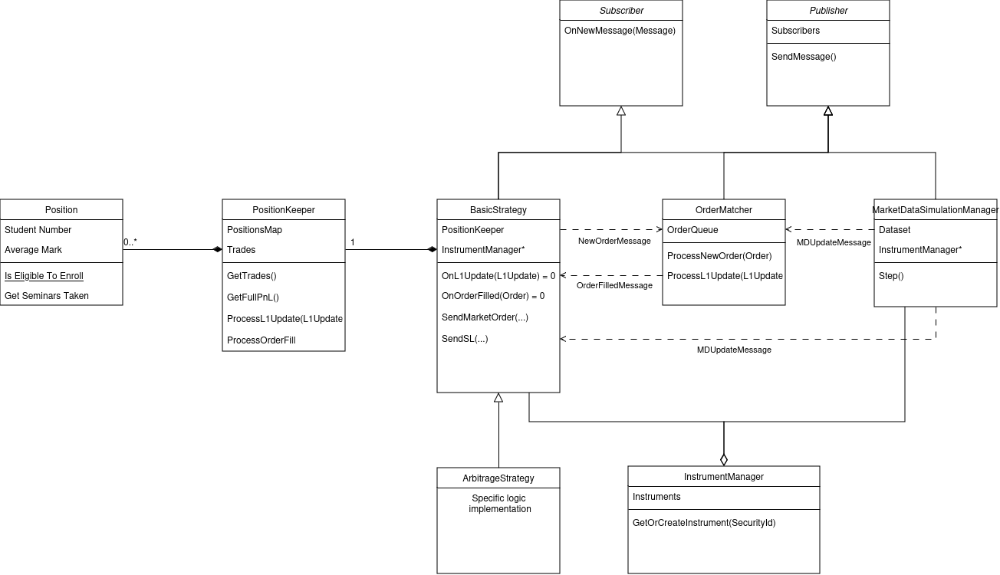

<h2>Dependencies</h2>
Before building make sure that you have these two installed: <br>
  <code>CMake 3.5.0+</code>
  <code>GTests</code>

<h2>Build</h2>
Run the following to clone and build the solution:

  ````bash
git clone https://github.com/hexteran/ArbSimulation &&
cd ArbSimulation &&
mkdir build &&
cd build &&
cmake .. &&
cmake --build .
  ````

Once building is done, you'll find binaries in <code>build/bin/</code>.

<h2>Run</h2>
You can find out that two executable files were generated.
You can use <code>./Test</code> to run unit tests and <code>./ArbSimulation</code> to run actual simulation.

> [!NOTE]  
> Make sure that you are running binaries from <code>build/bin/</code>, otherwise <code>./Test</code> may not find data files for unit tests, and <code>./ArbSimulation</code>
won't find default config (unless it is specified explicitly as an argument)


<h3>Configure simulation</h3>
To run <code>./ArbSimulation</code> correctly you need to provide proper configuration file. You can find examples in <code>configs/</code>.
If no arguments provided, <code>./ArbSimulation</code> uses <code>configs/default.json</code>. But you can specify the file you want to use.

For instance:

  ````bash
./ArbSimulation ../../configs/local_run.json
  ````

Before you run simulation using production data, make sure that correct data files are specified in the config file:
  ````json
{
	"X": 0.5,
	"Y": 1,
	"Z": -75,
	"Latencies":{"FutureA":0, "FutureB":0},
	"DataFiles":["/your/path/arbitrageFutureBData.csv", "/your/path/arbitrageFutureAData.csv"],
	"Reports":"../../reports"
}
  ````

<h3>Run on production data</h3>
If everything was done correctly, you'll see the following output:


  ````bash

hexteran@wrk-stn-1:~/temp/testgit/ArbSimulation/build/bin$ ./ArbSimulation ../../configs/local_run.json
Reading ../../configs/local_run.json:
	Parameter X = 0.5
	Parameter Y = 1
	Parameter Z = -75
	Latencies:
		FutureA: 40000000
		FutureB: 1000000
	DataFiles:
		/home/hexteran/Downloads/arbitrageFutureBData.csv
		/home/hexteran/Downloads/arbitrageFutureAData.csv
	ReportsFolder: ../../reports

Loading data

Running simulation...

SL is triggered
	FutureA PnL:-19;FutureB PnL:-58.5

Simulation is done!
***
	Final PnL is -77.5
	Trades are saved: ../../reports/trades_2024-09-08_10:44:47.csv
 
 ````

> [!NOTE]  
> If ReportsFolder was specified correctly, you'll see that the file with trades was generated

<h2>Architecture</h2>
Architecture of this solution is described schematically on a diagram below.

<p align="center">
  
</p>

<h2>Additionally</h2>
You can find some analysis of the results in <code>notebooks/</code>

Latency is simulated for execution only.


<h2>Number of hours</h2>
I spent around 25 hours on this solution.

 ````
04.09 ~6 hours: planning and coding simulation.hpp
05.09 ~5 hours: finalising simulation.hpp: testing, debugging; coding strategy.hpp
06.09 ~5 hours: finalising strategy.hpp: testing, debugging; coding arbitrage.hpp
07.09 ~5 hours: finalising arbitrage.hpp: testing, debugging; refactoring, analysis
08.09 ~3 hours: documenting and uploading of the final version
 ````
